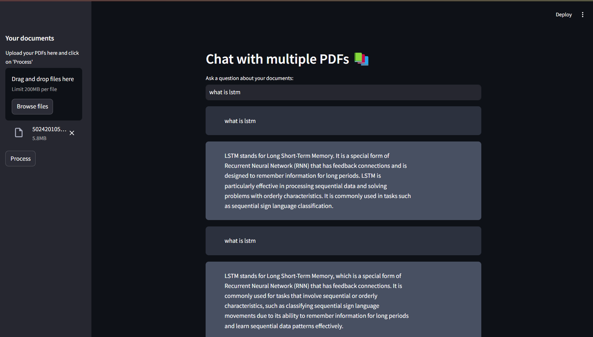
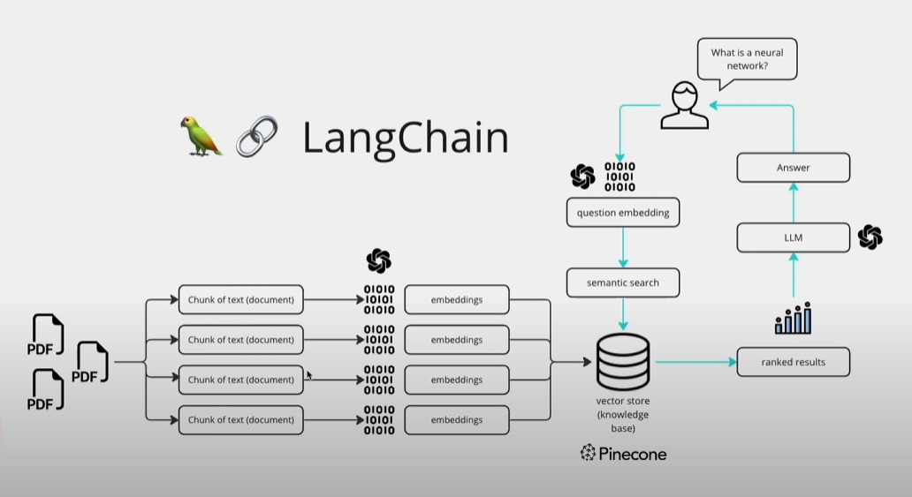

# Multi-PDF Chatbot using LangChain and OpenAI/HuggingFace LLM

This project demonstrates how to create a chatbot that can interact with multiple PDF documents using LangChain and either OpenAI's or HuggingFace's Large Language Model (LLM). The chatbot can answer questions based on the content of the PDFs and can be integrated into various applications for document-based conversational AI.

This project is implemented following this diagram flow below:

1. **PDF Processing**: Multiple PDF documents are divided into chunks of text.
2. **Embedding Creation**: Each chunk is converted into embeddings using the chosen LLM.
3. **Vector Store**: These embeddings are stored in a vector store (knowledge base), such as Pinecone.
4. **Question Processing**: A user's question is converted into an embedding.
5. **Semantic Search**: The question embedding is used to perform a semantic search in the vector store to find relevant document chunks.
6. **Answer Generation**: The relevant chunks are processed by the LLM to generate a ranked list of answers.
7. **User Interaction**: The answer is presented to the user.
